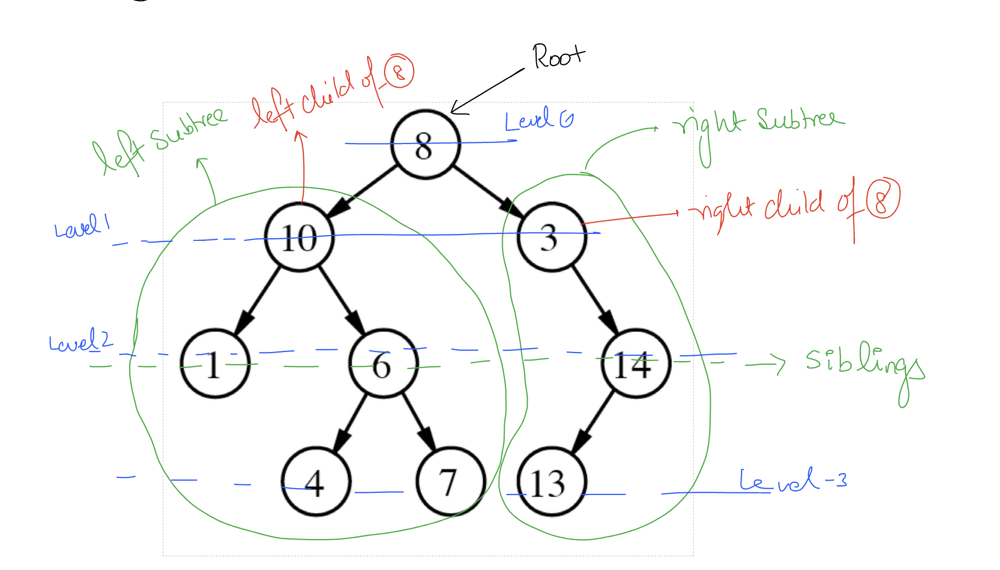
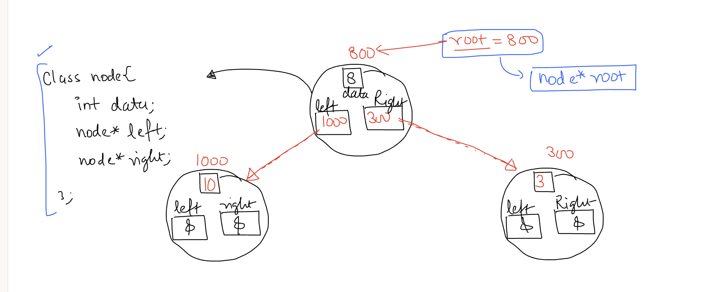

# Trees

## Binary Trees
 - They Have Only Two Child Of One Node or Root.
 - Left And Right Child.
 - 
 - We Create Node As 
    ```
        class node {
            int data;
            node * left;
            node * right;
        }
    ```
    
 - Need Recursion to create the tree.
    - Create Root Node Everything else will be done by recursion.
    ```
        node* createBTree() {
            int value;
            cin >> value;
            if (value == -1) {
                return NULL;
            }
            node* root = new node(value);
            root->left = createBTree();
            root->right = createBTree();
            return root;
        }

    ```
 - Traversal Algorithms 
    - PREORDER -- It is ROOT -> LEFT -> RIGHT
    - INORDER -- It is  LEFT -> ROOT -> RIGHT
    - POSTORDER -- It is LEFT -> RIGHT -> ROOT
    ```
        // ROOT LEFT RIGHT
        void preOder(node* root) {
            if (root == NULL) {
                return;
            }
            cout << root->data << " ";
            preOder(root->left);
            preOder(root->right);
        }

        // LEFT ROOT RIGHT
        void inOrder(node* root) {
            if (!root) {
                return;
            }
            inOrder(root->left);
            cout << root->data << " ";
            inOrder(root->right);
        }

        // LEFT RIGHT ROOT
        void postOrder(node* root) {
            if (!root) {
                return;
            }
            postOrder(root->left);
            postOrder(root->right);
            cout << root->data << " ";
        }
    ```
    - Count Nodes 
    ```
        int countNodes(node* root) {
            if (!root) {
                return 0;
            }

            return 1 + countNodes(root->left) + countNodes(root->right);
        }
    ```
