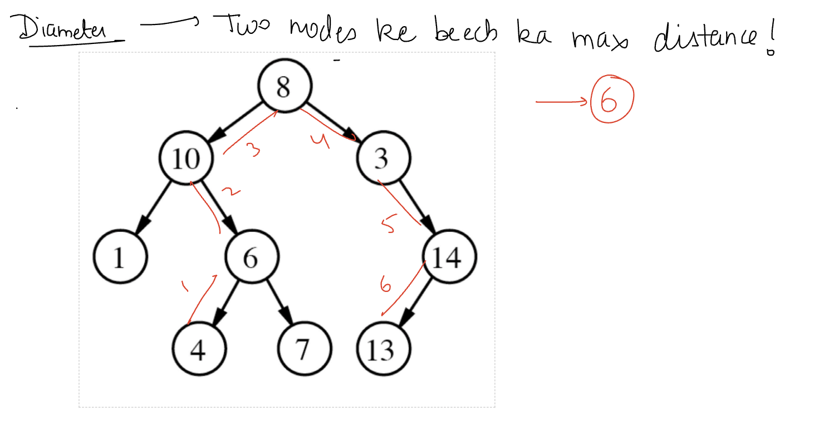
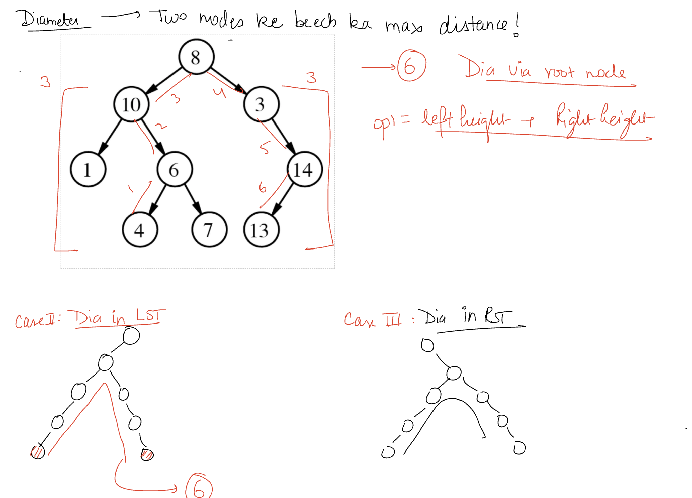
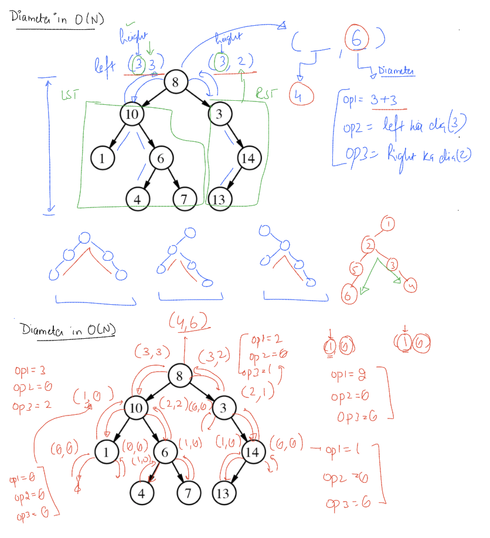

# Trees

## Binary Trees
 - They Have Only Two Child Of One Node or Root.
 - Left And Right Child.
 - 
 - We Create Node As
 return;
    ```
        class node {
            int data;
            node * left;
            node * right;
        }
    ```
    
 - Need Recursion to create the tree.
    - Create Root Node Everything else will be done by recursion.
    ```
        node* createBTree() {
            int value;
            cin >> value;
            if (value == -1) {
                return NULL;
            }
            node* root = new node(value);
            root->left = createBTree();
            root->right = createBTree();
            return root;
        }

    ```
 - Traversal Algorithms
    - PREORDER -- It is ROOT -> LEFT -> RIGHT
    - INORDER -- It is  LEFT -> ROOT -> RIGHT
    - POSTORDER -- It is LEFT -> RIGHT -> ROOT
    ```
        // ROOT LEFT RIGHT
        void preOder(node* root) {
            if (root == NULL) {
                return;
            }
            cout << root->data << " ";
            preOder(root->left);
            preOder(root->right);
        }

        // LEFT ROOT RIGHT
        void inOrder(node* root) {
            if (!root) {
                return;
            }
            inOrder(root->left);
            cout << root->data << " ";
            inOrder(root->right);
        }

        // LEFT RIGHT ROOT
        void postOrder(node* root) {
            if (!root) {
                return;
            }
            postOrder(root->left);
            postOrder(root->right);
            cout << root->data << " ";
        }
    ```
    - Count Nodes
    ```
        int countNodes(node* root) {
            if (!root) {
                return 0;
            }

            return 1 + countNodes(root->left) + countNodes(root->right);
        }
    ```

    - Height Of Tree
        - O(N) where N is Number Of Nodes.
    ```
        int heightOfTree(node* root) {
            if (!root) {
                return 0;
            }

            return 1 + max(heightOfTree(root->left), heightOfTree(root->right));
        }
    ```
 - Diameter Of A Tree is maximum distance between two node.
    - 
    - ### Three Cases :
        1. Diameter Through Root Node which is : Height Of LST  + Height Of RST
        2. Diameter Of LST.
        3. Diameter Of RST.
        ### We Chose The Maximum Of These 3 Options.
        
    ```
        int diameterOfTree(node* root) {
            if (!root) {
                return 0;
            }

            int option1 = heightOfTree(root->left) + heightOfTree(root->right);

            int option2 = diameterOfTree(root->left);
            int option3 = diameterOfTree(root->right);

            return max(option1, max(option2, option3));
        }
    ```
    - O(N ^ 2) where N is Number Of Nodes. Cause Finding Height Of All The Nodes.

    ## There Is A Faster Way For This Diameter Which Is O(N)
    ```
        class Pair {
            public:
                int height;
                int diameter;
                Pair() {
                    height = diameter = 0;
                }
        };

        Pair fastDiameter(node* root) {
            if (!root) {
                Pair p;
                return p;
            }

            Pair leftP = fastDiameter(root->left);
            Pair rightP = fastDiameter(root->right);

            Pair p;
            p.height = max(leftP.height, rightP.height) + 1;
            int option1 = leftP.height + rightP.height;
            int option2 = leftP.diameter;
            int option3 = rightP.diameter;

            p.diameter = max(option1, max(option2, option3));

            return p;
        }

    ```
    
